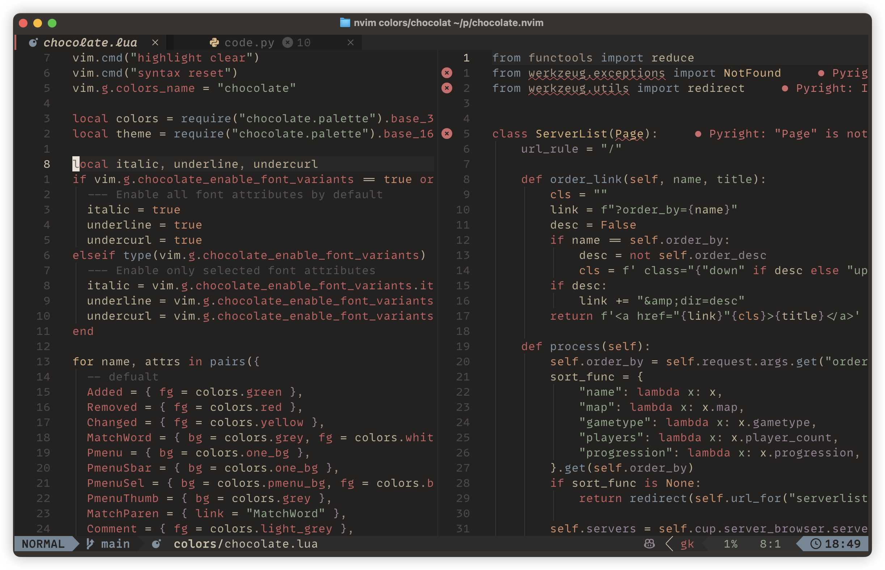

<p align="center">
  <h2 align="center">🍩 Chocolate.nvim</h2>
</p>
<p align="center">NeoVim dark colorscheme modified on Chocolate theme from <a href="https://github.com/NvChad/base46">NvChad's base46</a> theme collection.</p>

## Preview



## Installation

Using [lazy.nvim](https://lazy.folke.io/):

```lua
return {
  "philikarus/chocolate.nvim",
}
```

## Configuration

Default options:

```lua
vim.g.chocolate_enable_font_variants = {
  italic = false,
  underline = true,
  undercurl = true,
}
```

To configure it with lazy.nvim, for example:

```lua
return {
  "philikarus/chocolate.nvim",
  lazy = false,
  priority = 1000,
  config = function()
    vim.g.chocolate_enable_font_variants = {
      italic = true,
      underline = true,
      undercurl = true,
    }
  end,
}
```
